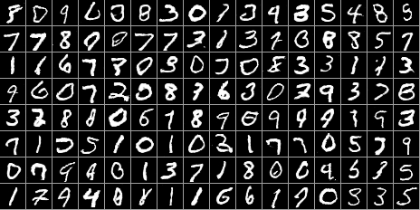
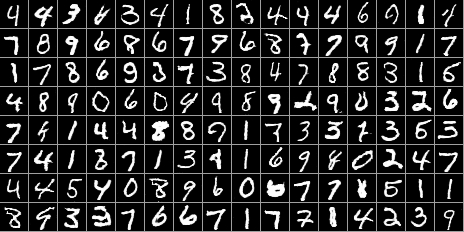
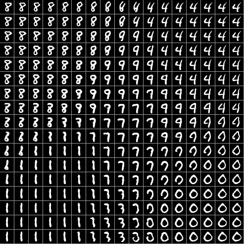

## Generative Adversarial Network Experiments 

Notebooks experimenting with Generative Adversarial Networks. Using Keras and Tensorflow.   

The convolutional model (`Convolutional_GAN.py`) worked best. 

Following:

* Goodfellow et. al, Generative Adversarial Nets
* Radford et. al., Unsupervised Representation Learning with Deep Convolutional Generative Adversarial Networks 

 

Random generator outputs:

 
Discriminator Favorites:

 
Transitions in the generator input space:

### License
MIT

