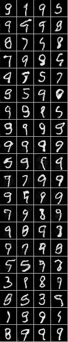

## Generative Adversarial Network Experiments 

Notebooks experimenting with Generative Adversarial Networks. Using Keras and Tensorflow.   

The convolutional model worked best. 

Following:

* Goodfellow et. al, Generative Adversarial Nets
* Radford et. al., Unsupervised Representation Learning with Deep Convolutional Generative Adversarial Networks 

Random generator outputs after 2 epochs:

### License
MIT

